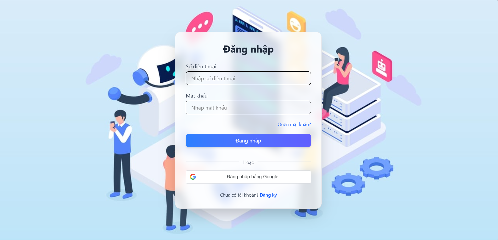
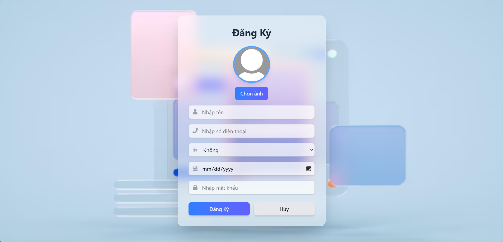
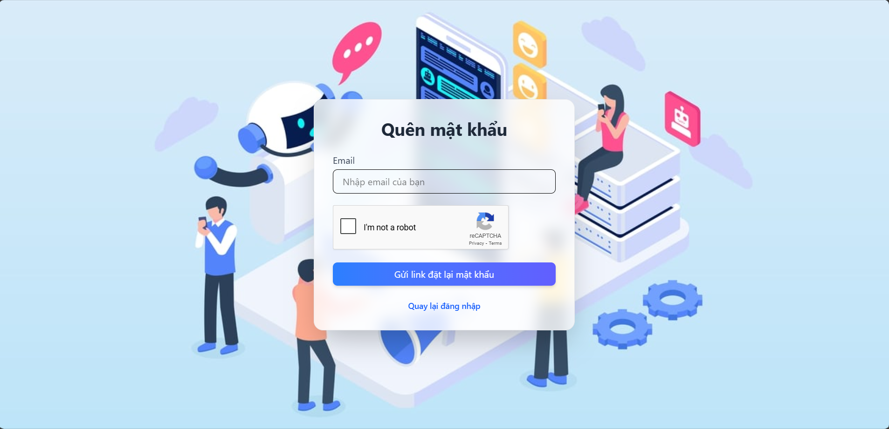

## Overview
A modern real-time messaging app with 1-on-1 video calls, instant chat, and smart social features like friend requests, group management, and birthday notifications. Designed for smooth, scalable, and intuitive communication.

## Features
🌟 Authentication & Authorization Secure user login, registration, and role-based access control.

💬 Realtime Chat Instant messaging between friends, groups, and cloud-based storage.

📹 1-on-1 Video Calling Direct video calls between friends with smooth real-time experience.

👥 Friend Management
    View incoming friend requests

    Manage connected friends

🧑‍🤝‍🧑 Group Management
    Track groups you've joined or created

    Real-time group messaging

🎂 Birthday Notifications Automatically send birthday reminders for your friends

🔐 Secure Password Reset
    Users can securely reset their password via email verification. The process includes:

    Sending a password reset link to the user's registered email

    CAPTCHA validation to prevent automated abuse
    
    Token-based verification to ensure the request is legitimate and time-limited

## Built with


## Run project
### Requierment
- Dotnet version 8 or later
- Nodejs v20.15.0 or later
### Installation
1. Clone this project
```bash
# Frontend
git clone https://github.com/maivantai2003/chatgroup-client

# Backend
git clone https://github.com/maivantai2003/chatgroup-server

```
2. Run server (You can do this step on IDE like Visual Studio)
Change connectionString on Job_assignment_management.Api/appsettings.json
```json
{
"ConnectionStrings": {
    "Connection": "Data Source=[YOUR_SERVER_NAME];Initial Catalog=AILOApp;Integrated Security=True;Encrypt=True;Trust Server Certificate=True"
  }
```
If your use user-password server
```json
    "ConnectionStrings":  {
"Connection":  "Data Source=[YOUR_SERVER_NAME];Initial Catalog=AILOApp;Integrated;User Id=sa;Password=[YOUR_PASSWORD];Encrypt=True;Trust Server Certificate=True"

},
```

Set Default Project
1. Open Package Manager Console (go to Tools > NuGet Package Manager > Package Manager Console).

2. In the Package Manager Console, look for the dropdown labeled Default project on the right-hand side.

3. Select Job_assignment_management.Infrastructure as the Default Project.

Run Commands

```bash
# Create a Migration
Add-Migration InitialCreate

# Update the Database
Update-Database
```

Important Notes

- Make sure Job_assignment_management.Api is set as the Startup Project in Visual Studio (right-click the project > select Set as Startup Project).
- Ensure the correct connection string is configured in the appsettings.json or appsettings.Development.json file of the API project.

3. Run Client

Install dependencies and run app:
```bash
npm install

npm run dev
```

## Demo
**Authentication**




<!-- **Project management**


**Account management**

 -->


#### Contact email:
- [vantai08122003@gmail.com](mailto:vantai08122003@gmail.com)
